# KubeSensei 🧠

**A Kubernetes Assistant powered by AI that converts natural language queries into kubectl commands with automated troubleshooting and intelligent explanations.**

## Overview

KubeSensei is an intelligent Kubernetes management tool that bridges the gap between natural language and kubectl commands. It leverages AWS Bedrock (Claude 3 Haiku) and LangGraph to provide a conversational interface for Kubernetes operations, complete with automated troubleshooting and detailed explanations.

## Key Features

- **Natural Language to kubectl**: Convert plain English requests into proper kubectl commands
- **Automated Execution**: Run commands safely within the cluster
- **Intelligent Troubleshooting**: Automatic pod diagnostics and log analysis
- **Real-time Status Monitoring**: Visual pod status indicators with color-coded health checks
- **Containerized Deployment**: Fully containerized with proper RBAC permissions
- **Interactive Web Interface**: Clean Streamlit-based UI for easy interaction

## Architecture

### System Architecture Overview


### Component Block Diagram

```mermaid
block-beta
    columns 4
    
    block:UI_LAYER:1
        UI_BLOCK["Streamlit Web UI<br/>• Interactive Dashboard<br/>• Real-time Status<br/>• Port 8501"]
    end
    
    block:WORKFLOW_LAYER:3
        WORKFLOW_TITLE["LangGraph Workflow Layer"]
        GEN_BLOCK["Generate Command<br/>• Natural Language Processing<br/>• Prompt Template Engine<br/>• kubectl Generation"]
        EXEC_BLOCK["Execute Command<br/>• Subprocess Execution<br/>• Health Detection<br/>• Diagnostics Collection"]
        EXPL_BLOCK["Explain Output<br/>• AI Analysis<br/>• Troubleshooting<br/>• User Explanation"]
    end
    
    block:LANGCHAIN_LAYER:2
        LANGCHAIN_TITLE["LangChain Integration"]
        CHATBR_BLOCK["ChatBedrock<br/>• AWS Integration<br/>• Model Interface<br/>• Response Handling"]
        PROMPT_BLOCK["PromptTemplate<br/>• kubectl_prompt<br/>• explain_prompt<br/>• Variable Injection"]
    end
    
    block:SYSTEM_LAYER:2
        SYSTEM_TITLE["System Components"]
        KUBECTL_BLOCK["kubectl CLI<br/>• Command Execution<br/>• Output Capture<br/>• RBAC Integration"]
        SUBPROC_BLOCK["Python Subprocess<br/>• Process Management<br/>• Error Handling<br/>• Stream Capture"]
    end
    
    block:EXTERNAL_LAYER:1
        AWS_BLOCK["AWS Bedrock<br/>• Claude 3 Haiku<br/>• us-east-1 Region<br/>• IAM Authentication"]
    end
    
    block:K8S_LAYER:3
        K8S_TITLE["Kubernetes Cluster"]
        API_BLOCK["API Server<br/>• Resource Management<br/>• Authentication<br/>• Cluster State"]
        RESOURCE_BLOCK["Resources<br/>• Pods<br/>• Services<br/>• Deployments"]
        LOGS_BLOCK["Diagnostics<br/>• Container Logs<br/>• Events<br/>• Error States"]
    end
    
    block:SECURITY_LAYER:3
        SECURITY_TITLE["RBAC Security"]
        SA_BLOCK["ServiceAccount<br/>• kubesensei-sa<br/>• Identity Management"]
        SECRET_BLOCK["AWS Secret<br/>• Access Keys<br/>• Region Config<br/>• Base64 Encoded"]
        RBAC_BLOCK["ClusterRoleBinding<br/>• cluster-admin<br/>• Full Permissions"]
    end
    
    %% Connections between blocks
    UI_BLOCK --> GEN_BLOCK
    GEN_BLOCK --> EXEC_BLOCK
    EXEC_BLOCK --> EXPL_BLOCK
    EXPL_BLOCK --> UI_BLOCK
    
    GEN_BLOCK --> CHATBR_BLOCK
    EXPL_BLOCK --> CHATBR_BLOCK
    CHATBR_BLOCK --> PROMPT_BLOCK
    CHATBR_BLOCK --> AWS_BLOCK
    
    EXEC_BLOCK --> KUBECTL_BLOCK
    EXEC_BLOCK --> SUBPROC_BLOCK
    KUBECTL_BLOCK --> API_BLOCK
    
    API_BLOCK --> RESOURCE_BLOCK
    API_BLOCK --> LOGS_BLOCK
    
    KUBECTL_BLOCK --> SA_BLOCK
    SA_BLOCK --> RBAC_BLOCK
    SECRET_BLOCK --> AWS_BLOCK
```



### Data Flow Architecture


## LangChain Integration Deep Dive

### LangChain's Role in KubeSensei

LangChain serves as the **AI orchestration backbone** that bridges natural language processing with Kubernetes operations. Here's how each LangChain component contributes:

#### 🔗 **ChatBedrock Integration**
```python
# LangChain handles AWS Bedrock connectivity
llm = ChatBedrock(
    model_id="anthropic.claude-3-haiku-20240307-v1:0",
    region_name="us-east-1"
)
```
**Functions:**
- **Model Abstraction**: Provides unified interface to AWS Bedrock
- **Authentication Management**: Handles AWS credential integration
- **Response Standardization**: Normalizes AI model outputs
- **Error Handling**: Manages connection failures and retries

#### 📋 **PromptTemplate Engine**
```python
# Specialized templates for different workflow phases
kubectl_prompt = PromptTemplate(
    input_variables=["query"],
    template="Convert user request into kubectl command..."
)

explain_prompt = PromptTemplate(
    input_variables=["command_output"],
    template="Analyze Kubernetes output and provide troubleshooting..."
)
```
**Functions:**
- **Context Injection**: Dynamically inserts user queries and system data
- **Prompt Optimization**: Engineered templates for specific Kubernetes tasks
- **Variable Management**: Handles dynamic content replacement
- **Consistency**: Ensures reliable AI behavior across different inputs

#### ⚡ **Chain Operations & Response Processing**
```python
# LangChain manages the LLM invocation lifecycle
response = llm.invoke(kubectl_prompt.format(query=query))
text = response.content if hasattr(response, "content") else str(response)
```
**Functions:**
- **Invocation Management**: Handles async/sync LLM calls
- **Content Extraction**: Parses structured responses from AI models
- **Format Validation**: Ensures responses meet expected formats
- **Fallback Handling**: Manages malformed or unexpected responses

### LangChain vs LangGraph Division of Labor

| Component | Responsibility | Technology |
|-----------|---------------|------------|
| **Workflow Orchestration** | State management, node transitions, execution flow | 🔄 **LangGraph** |
| **AI Model Integration** | LLM connectivity, prompt management, response handling | 🔗 **LangChain** |
| **Business Logic** | kubectl execution, diagnostics collection, error handling | 🐍 **Pure Python** |
| **User Interface** | Web interface, visualization, user interaction | 🎨 **Streamlit** |

### LangChain Processing Pipeline

```mermaid
graph LR
    subgraph "🔗 LangChain Processing Layer"
        INPUT["`**User Query**
        Natural Language`"]
        
        TEMPLATE["`**PromptTemplate**
        📋 Format & Context
        🎯 Task-Specific Prompts`"]
        
        MODEL["`**ChatBedrock**
        🤖 Claude 3 Haiku
        ☁️ AWS Integration`"]
        
        PARSE["`**Response Parser**
        📤 Content Extraction
        ✅ Format Validation`"]
        
        OUTPUT["`**Structured Output**
        kubectl Commands
        Explanations`"]
        
        INPUT --> TEMPLATE
        TEMPLATE --> MODEL
        MODEL --> PARSE
        PARSE --> OUTPUT
    end
    
    classDef langchain fill:#fff3e0,stroke:#e65100,stroke-width:2px
    class INPUT,TEMPLATE,MODEL,PARSE,OUTPUT langchain
```



## Internal Workflow

### Three-Phase Processing Pipeline

```mermaid
graph TB
    subgraph "Phase 1: 🧠 Command Generation"
        P1_INPUT["`**Natural Language Query**
        'Show me failing pods'
        'Get logs for nginx'`"]
        
        P1_LANGCHAIN["`**LangChain Processing**
        📋 kubectl_prompt template
        🔗 ChatBedrock invocation
        🎯 Response parsing`"]
        
        P1_OUTPUT["`**Generated kubectl Command**
        kubectl get pods --field-selector=status.phase!=Running
        kubectl logs nginx-pod`"]
        
        P1_INPUT --> P1_LANGCHAIN
        P1_LANGCHAIN --> P1_OUTPUT
    end
    
    subgraph "Phase 2: ⚡ Command Execution & Diagnostics"
        P2_EXEC["`**Subprocess Execution**
        🔧 subprocess.run()
        📊 stdout/stderr capture
        ✅ Exit code handling`"]
        
        P2_ANALYSIS["`**Output Analysis**
        🔍 Pod status detection
        ⚠️ Issue identification
        📋 Health assessment`"]
        
        P2_DIAG["`**Automated Diagnostics**
        kubectl describe pod <failing-pods>
        kubectl logs <failing-pods> --tail=50
        📊 Comprehensive data collection`"]
        
        P1_OUTPUT --> P2_EXEC
        P2_EXEC --> P2_ANALYSIS
        P2_ANALYSIS --> P2_DIAG
    end
    
    subgraph "Phase 3: 🔍 AI Analysis & Explanation"
        P3_COMBINE["`**Data Aggregation**
        📊 Command output
        🩺 Diagnostic information
        🔄 State compilation`"]
        
        P3_LANGCHAIN["`**LangChain Analysis**
        📋 explain_prompt template
        🤖 AI troubleshooting
        💡 Solution generation`"]
        
        P3_OUTPUT["`**User-Friendly Response**
        🟢 Status indicators
        📝 Detailed explanations
        🛠️ Actionable recommendations`"]
        
        P2_DIAG --> P3_COMBINE
        P3_COMBINE --> P3_LANGCHAIN
        P3_LANGCHAIN --> P3_OUTPUT
    end
    
    classDef phase1 fill:#e8f5e8,stroke:#1b5e20,stroke-width:2px
    classDef phase2 fill:#e3f2fd,stroke:#0277bd,stroke-width:2px
    classDef phase3 fill:#fff3e0,stroke:#e65100,stroke-width:2px
    
    class P1_INPUT,P1_LANGCHAIN,P1_OUTPUT phase1
    class P2_EXEC,P2_ANALYSIS,P2_DIAG phase2
    class P3_COMBINE,P3_LANGCHAIN,P3_OUTPUT phase3
```



### 1. Command Generation Phase
- **Input**: User's natural language request
- **LangChain Role**: 
  - Formats query using `kubectl_prompt` template
  - Invokes Claude 3 Haiku via ChatBedrock
  - Parses response to extract valid kubectl command
- **Output**: Valid kubectl command string
- **Error Handling**: Validates that a proper kubectl command was generated

### 2. Command Execution Phase
- **Execution**: Runs the kubectl command using Python subprocess
- **Pod Detection**: Analyzes output to identify existing pods and their statuses
- **Issue Detection**: Scans for problematic statuses (Pending, CrashLoopBackOff, Error)
- **Diagnostics Collection**: For failing pods, automatically runs:
  - `kubectl describe pod <pod-name>` - Detailed pod information
  - `kubectl logs <pod-name> --tail=50` - Recent pod logs

### 3. Explanation & Analysis Phase
- **Context Building**: Combines command output with diagnostic information
- **LangChain Role**:
  - Uses `explain_prompt` template with combined data
  - Invokes Claude 3 Haiku for intelligent analysis
  - Extracts structured explanation from AI response
- **AI Analysis**: Claude 3 Haiku provides intelligent explanations of:
  - What the command accomplished
  - Why pods might be failing
  - Specific troubleshooting recommendations
- **User-Friendly Output**: Presents technical information in accessible language

## Technology Stack

### Core Technologies
- **Python 3.12**: Runtime environment
- **Streamlit**: Web interface framework
- **LangChain**: LLM integration and prompt management
- **LangGraph**: Workflow orchestration and state management
- **AWS Bedrock**: AI model hosting (Claude 3 Haiku)
- **kubectl**: Kubernetes command-line interface

### Kubernetes Integration
- **Service Account**: `kubesensei-sa` for secure cluster access
- **RBAC**: Cluster-admin permissions for full kubectl functionality
- **Secrets Management**: AWS credentials stored as Kubernetes secrets
- **Container Deployment**: Multi-stage Docker build for optimized images

## Security Model

### RBAC Configuration
```yaml
ServiceAccount: kubesensei-sa
ClusterRole: cluster-admin (full access)
ClusterRoleBinding: Connects SA to cluster-admin role
```

### AWS Authentication
- AWS credentials stored as Kubernetes secrets
- Environment variables injected into container
- Region configured for us-east-1

### Network Security
- Internal cluster communication only
- NodePort service (30080) for external access
- No direct internet access required for core functionality

## Deployment Architecture

### Container Strategy
- **Multi-stage Docker build** for optimized image size
- **Builder stage**: Installs dependencies and kubectl
- **Runtime stage**: Minimal Python slim image with only necessary components
- **Health checks**: Streamlit server on port 8501

### Kubernetes Resources
1. **Namespace**: default (configurable)
2. **ServiceAccount**: Provides cluster access identity
3. **Secret**: AWS credentials for Bedrock access
4. **Deployment**: Single replica with resource management
5. **Service**: NodePort for external web access
6. **RBAC**: ClusterRole and binding for permissions

## State Management

The LangGraph workflow maintains state across three phases:

```python
State = {
    "query": str,           # Original user input
    "command": str,         # Generated kubectl command
    "raw_output": str,      # Command execution results
    "diagnostics": str,     # Pod troubleshooting info
    "pod_statuses": list,   # Pod health status pairs
    "output": str          # Final AI explanation
}
```

## Error Handling & Resilience

### Command Generation
- Validates kubectl command format
- Handles LLM response parsing errors
- Provides fallback error messages

### Command Execution
- Captures both stdout and stderr
- Handles subprocess execution failures
- Graceful handling of missing resources

### Diagnostic Collection
- Continues operation if individual pods fail to describe/log
- Uses `|| true` pattern for non-critical operations
- Provides partial results when possible

## Usage Examples

### Basic Pod Management
- "Show me all pods in the default namespace"
- "Get the logs for the nginx pod"
- "Describe the failing pods"

### Resource Inspection
- "List all services"
- "Show deployments that aren't ready"
- "Get details about the database pod"

### Troubleshooting
- "Why is my pod not starting?"
- "Show me pods with issues"
- "What's wrong with the crashed containers?"

## Installation & Setup

### Prerequisites
- Kubernetes cluster with kubectl access
- AWS account with Bedrock access
- Docker for image building (optional)

### Quick Deploy
1. **Configure AWS credentials** in `k8s/secrets.yaml`
2. **Deploy to Kubernetes**:
   ```bash
   kubectl apply -f k8s/
   ```
3. **Access the interface**:
   ```
   http://<node-ip>:30080
   ```

### Local Development
1. **Install dependencies**:
   ```bash
   pip install -r requirements.txt
   ```
2. **Configure AWS credentials**
3. **Run locally**:
   ```bash
   streamlit run app.py
   ```

## Configuration

### Environment Variables
- `AWS_REGION`: AWS region for Bedrock (default: us-east-1)
- `AWS_ACCESS_KEY_ID`: AWS access key
- `AWS_SECRET_ACCESS_KEY`: AWS secret key
- `STREAMLIT_PORT`: Web interface port (default: 8501)

### Customization Options
- **LLM Model**: Change model_id in app.py for different Claude versions
- **Prompt Templates**: Modify templates for different behavior
- **RBAC Permissions**: Adjust cluster-role.yaml for specific access needs
- **Resource Limits**: Configure in deployment.yaml

## Monitoring & Observability

### Built-in Monitoring
- Real-time pod status indicators
- Command execution logging
- Error tracking and display

### External Integration
- Compatible with standard Kubernetes monitoring tools
- Logs accessible via kubectl logs
- Metrics available through standard Kubernetes APIs

## Future Enhancements

### Planned Features
- Multi-namespace support
- Command history and favorites
- Resource creation capabilities
- Advanced RBAC configuration
- Integration with monitoring tools

### Extensibility
- Pluggable LLM backends
- Custom prompt templates
- Additional kubectl command patterns
- Integration with GitOps workflows

## Contributing

KubeSensei is designed for extensibility. Key areas for contribution:
- Additional prompt templates for specialized use cases
- Enhanced error handling and recovery
- Support for additional Kubernetes resources
- UI/UX improvements
- Performance optimizations

## License & Support

This project demonstrates modern AI-powered DevOps tooling patterns and serves as a foundation for intelligent Kubernetes management solutions.
